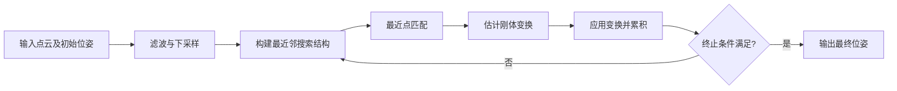

# ICP（Iterative Closest Point）求解流程指南

本文以 Markdown 形式梳理 ICP 算法的求解过程，帮助你快速掌握点云配准中最经典的迭代最近点方法。内容涵盖算法原理、关键步骤、常见变体以及工程实践建议，可与开源实现（如 PCL、Open3D、ROS 中的 `icp` 节点）搭配阅读。

---

## 1. 算法概述

- **目标**：给定源点云 $\mathcal{P}$ 和目标点云 $\mathcal{Q}$，估计刚体变换 $(\mathbf{R}, \mathbf{t})$ 使得变换后的点云 $\mathbf{R} \mathcal{P} + \mathbf{t}$ 与 $\mathcal{Q}$ 尽可能对齐。
- **假设**：两帧点云之间的真实相对位姿较小，点云具有足够的重叠区域。
- **核心思想**：交替执行“建立最近点对应关系”与“基于对应关系求解刚体变换”两个步骤，直到收敛。

---

## 2. 标准 ICP 求解流程



1. **准备与预处理**：对源、目标点云进行滤波、下采样、法向量估计等操作。
2. **对应点搜索**：通常使用 KD-Tree 或八叉树加速最近邻查询。
3. **求解最优变换**：最常见的是 SVD 法求解点到点最小二乘；也可选点到平面等变体。
4. **更新源点云**：用求得的变换更新源点云或累计到当前全局位姿。
5. **收敛判定**：若迭代次数达到上限、误差下降小于阈值或配准残差足够小，则停止。

---

## 3. 关键步骤详解

### 3.1 数据准备
- 输入点云需要在同一坐标系（或给定粗略初始位姿线索）。
- 常见来源：激光雷达帧、深度相机帧、CAD 模型采样点等。

### 3.2 预处理建议
- **体素下采样**（Voxel Grid）：降低点数、提升速度。
- **离群点剔除**：统计滤波、半径滤波、RANSAC 平面剔除等。
- **法向量估计**：为点到平面 ICP 或基于法向的权重提供支持。
- **尺度校验**：ICP 默认刚体假设，不适用于尺度变化明显的场景。

### 3.3 最近点匹配
- 构建目标点云的 KD-Tree：$\mathcal{Q}$ 预处理一次即可。
- 对每个源点 $\mathbf{p}_i$，找到目标点 $\mathbf{q}_i$ 使得
  $$
  \mathbf{q}_i = \arg\min_{\mathbf{q} \in \mathcal{Q}} \| \mathbf{R}_{k-1} \mathbf{p}_i + \mathbf{t}_{k-1} - \mathbf{q} \|^2
  $$
- 匹配策略：最近邻、双向最近邻（Reciprocal）、拒绝超过最大距离的匹配。

### 3.4 刚体变换求解（点到点 SVD）
1. 计算对应点的质心：
   $$
   \bar{\mathbf{p}} = \frac{1}{N}\sum_i \mathbf{p}_i, \quad \bar{\mathbf{q}} = \frac{1}{N}\sum_i \mathbf{q}_i
   $$
2. 构造去中心化矩阵：
   $$
   \mathbf{H} = \sum_i (\mathbf{p}_i - \bar{\mathbf{p}})(\mathbf{q}_i - \bar{\mathbf{q}})^T
   $$
3. 对 $\mathbf{H}$ 做奇异值分解：$\mathbf{H} = \mathbf{U} \mathbf{\Sigma} \mathbf{V}^T$。
4. 旋转矩阵：$\mathbf{R} = \mathbf{V} \begin{bmatrix}1 & 0 & 0 \\ 0 & 1 & 0 \\ 0 & 0 & \det(\mathbf{V}\mathbf{U}^T) \end{bmatrix} \mathbf{U}^T$。
5. 平移向量：$\mathbf{t} = \bar{\mathbf{q}} - \mathbf{R}\bar{\mathbf{p}}$。

### 3.5 状态更新
- 若维护全局位姿：累积 $\mathbf{T}_\text{new} = [\mathbf{R}\,|\,\mathbf{t}] \cdot \mathbf{T}_\text{old}$。
- 若直接更新源点云：对所有点执行 $\mathbf{p}_i \leftarrow \mathbf{R}\mathbf{p}_i + \mathbf{t}$。

### 3.6 收敛判据
- 最大迭代次数 $k_{\max}$。
- 前后两次残差 $\epsilon_k$ 的相对变化小于阈值 $\delta$：
  $$
  \frac{|\epsilon_k - \epsilon_{k-1}|}{\epsilon_{k-1}} < \delta
  $$
- 平移或旋转更新量低于阈值：$\|\mathbf{t}\| < t_{\min}$，$\arccos((\text{trace}(\mathbf{R}) - 1)/2) < \theta_{\min}$。

---

## 4. 目标函数与误差度量

标准 ICP 最小化点对点的平方误差：
$$
E(\mathbf{R}, \mathbf{t}) = \sum_i \|\mathbf{R} \mathbf{p}_i + \mathbf{t} - \mathbf{q}_i\|^2
$$

常见扩展：
- **点到平面**：利用目标点云的法向量 $\mathbf{n}_i$，误差为
  $$E = \sum_i \left( \mathbf{n}_i^T (\mathbf{R}\mathbf{p}_i + \mathbf{t} - \mathbf{q}_i) \right)^2 $$
- **广义 ICP (GICP)**：引入各点局部协方差，加权最小二乘。
- **彩色 ICP**：除了几何误差，还联合颜色残差。

---

## 5. 伪代码示例

```pseudo
Input: 点云 P (源), Q (目标), 初始位姿 T0, 最大迭代 k_max
Output: 最终配准位姿 T

T <- T0
for k in 1..k_max:
    # Step 1: 将源点云变换到当前位姿
    P_transformed <- Transform(P, T)

    # Step 2: 最近邻匹配（可带距离阈值）
    correspondences <- FindNearestNeighbors(P_transformed, Q)

    # Step 3: 过滤对应关系（去除异常 & 低权匹配）
    correspondences <- RejectOutliers(correspondences)
    if correspondences is empty:
        break

    # Step 4: 基于对应关系求解刚体增量 ΔT
    ΔT <- SolveRigidTransform(correspondences)

    # Step 5: 更新位姿
    T <- ΔT * T

    # Step 6: 判断收敛
    if Converged(ΔT, residual_change):
        break
return T
```

---

## 6. 常见改进与变体

| 变体 | 核心思想 | 适用场景 |
| --- | --- | --- |
| 点到平面 ICP | 使用点的法向量构建误差，提高局部平面上的收敛速度 | 室内、结构化环境 |
| Generalized ICP | 将点视为局部高斯分布，最小化协方差加权误差 | 稀疏或噪声较大的点云 |
| Colored ICP | 同时利用颜色或强度信息 | RGB-D、彩色点云 |
| Sparse ICP / Trimmed ICP | 引入鲁棒核或裁剪高残差匹配 | 存在大量外点时 |
| Multi-scale ICP | 由粗到细逐步减小体素或匹配阈值 | 提升全局收敛性 |

---

## 7. 工程实践建议

1. **良好的初始位姿**：可用里程计、IMU、特征匹配或 NDT 等方法提供初值。
2. **多分辨率策略**：先对低分辨率点云配准，再逐步细化，可避免局部最优。
3. **匹配过滤**：常用阈值包括最大距离、法向夹角、对应点密度等。
4. **鲁棒损失函数**：Huber、Cauchy 等能抑制离群点影响。
5. **迭代监控**：记录残差与位姿变化趋势，及时发现发散或退化。
6. **并行加速**：对于海量点云，考虑 GPU KD-Tree、近似最近邻（如 FLANN）。
7. **与地图维护结合**：在 SLAM 中需配合关键帧管理、闭环检测等模块共同使用。

---

## 8. 学习与调试路线

1. **阅读经典论文**：Besl & McKay (1992)、Chen & Medioni (1992)。
2. **动手实现简易 ICP**：仅处理二维点云，验证算法收敛性质。
3. **引入高级特性**：法向量、鲁棒损失、多分辨率等逐一添加。
4. **实验参数影响**：调整匹配距离、迭代次数、下采样尺寸，观察配准效果。
5. **对比不同实现**：PCL `pcl::IterativeClosestPoint`、Open3D `registration_icp`、libpointmatcher 等。

---

## 9. 参考资料

- P. J. Besl and N. D. McKay, “A Method for Registration of 3-D Shapes,” *IEEE TPAMI*, 1992.
- Y. Chen and G. Medioni, “Object Modelling by Registration of Multiple Range Images,” *Image and Vision Computing*, 1992.
- Open3D Documentation: [Registration Module](http://www.open3d.org/docs/release/tutorial/pipelines/icp_registration.html)
- PCL Documentation: [Iterative Closest Point](https://pointclouds.org/documentation/tutorials/iterative_closest_point.html)
- libpointmatcher: [ICP Library](https://github.com/ethz-asl/libpointmatcher)

> 建议在阅读本文后，结合项目中的传感器模型和仿真环境，亲自运行一次 ICP 配准实验，加深对每个步骤的理解。